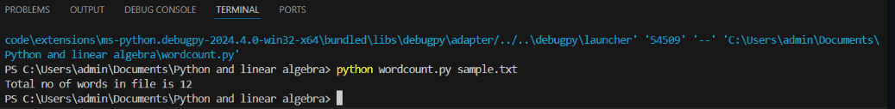

# EX9 Command--line-arguments-to-count-word
## AIM:
To write a python program for getting the word count from the contents of a file using command line arguments.
## EQUIPEMENT'S REQUIRED: 
PC
Anaconda - Python 3.7
## ALGORITHM: 
### Step 1:
Start the program.
### Step 2: 
Create a text file in which words has to be counted.
### Step 3: 
Open python file in visual studio code.
### Step 4:  
Execute the program.
### Step 5: 
Print the output.
### Step 6: 
End the program.
## PROGRAM:
```
#Command line arguments - word count
#Developed by: HARINI R
#Register number:212223100010

import sys
count=0
with open(sys.srgv[1],'r')as f1:
    for line in f1:
        word=line.split()
        count += len(word)
    print("word count in file = ",count)
```
### OUTPUT:



## RESULT:
Thus the program is written to find the word count from the contents of a file using command line arguments.
